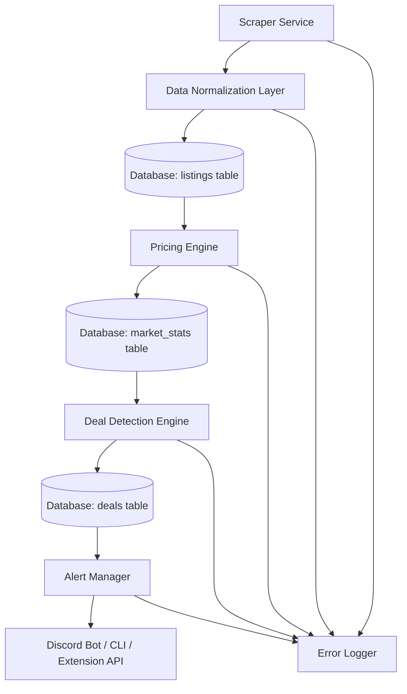

# System Architecture

## Overview
The GPU Arbitrage Bot is a data pipeline that scrapes eBay GPU listings, computes market prices from historical sales data, detects deals, and alerts users via Discord, CLI, or browser extension.

## Data Flow Diagram

## Component Interactions

1. **Scraper Service**: Fetches active GPU listings from eBay using Playwright for rendering and BeautifulSoup for parsing. Outputs JSON/dict objects with raw listing data.

2. **Data Normalization Layer**: Cleans and transforms raw data to match database schema. Handles missing fields, data type conversions, and basic validation.

3. **Database (SQLite)**:
   - `listings`: Stores normalized active listings.
   - `market_stats`: Stores computed market prices and trends.
   - `deals`: Stores detected deals with scores.

4. **Pricing Engine**: Queries historical sales data (from CSVs or separate DB) to compute medians, weighted medians, and trends per GPU model.

5. **Deal Detection Engine**: Compares listing prices to market prices, applies scoring algorithm, and flags deals.

6. **Alert Manager**: Filters deals by score thresholds, handles deduplication, and routes alerts to outputs.

7. **Outputs**:
   - Discord Bot: Posts formatted alerts to channel.
   - CLI: Prints alerts to terminal.
   - Extension API: Provides data for Firefox extension overlays.

## Error Handling

- **Scraper Failures**: Retry up to 3 times with exponential backoff. Log errors to `gpu_scrape_errors/` CSV. Skip failed listings and continue.
- **Data Normalization**: Validate required fields (e.g., price, title). Set defaults for missing optional fields. Log warnings for data quality issues.
- **Database Errors**: Use transactions for atomic operations. Log connection/query failures.
- **Engine Failures**: Graceful degradation (e.g., skip pricing if no historical data). Log exceptions.
- **Alert Failures**: Retry Discord posts. Fallback to CLI if bot unavailable.
- **Global**: All components log to console/files. Use try-except blocks extensively.

## Dependencies
- Python 3.8+
- Libraries: sqlite3, requests, discord.py, pandas, playwright, beautifulsoup4
- External APIs: eBay (scraping), Discord (bot)